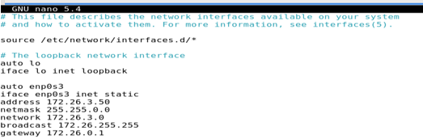
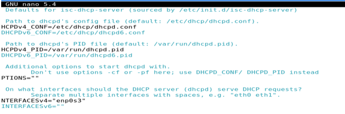
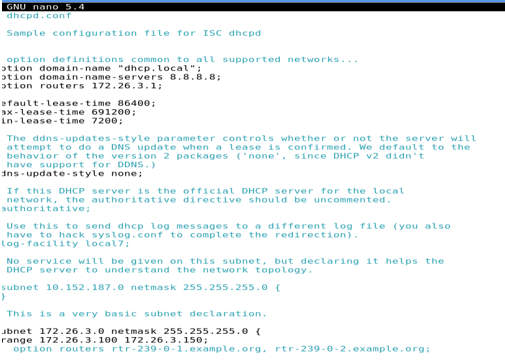

# CREAR SERVIDOR DHCP CON 2 TARJETAS

En esta forma vamos a crear el servidor DHCP, lo vamos a configurar con dos tarjetas; 
- 1º tarjeta: Adaptador puente; para poder salir a internet.
- 2º tarjeta: Red interna; para conectar el cliente en una red propia del servidor.

------------------------------------------------------------------------------------------------------

Empecemos con el servidor. 
Nos metemos en el fichero de configuración **/etc/network/interfaces**, para configurar la ip estáticamente.

Ahora reiniciaremos el servicio Networking -> 
` systemctl restart networking `

Ahora configuramos el siguiente fichero: **/etc/default/isc-dhcp-server**

> Antes tendremos que mirar el nombre de nuestra tarjeta de red. En mi caso se llame *enp0s3*

También configuraremos el siguiente archivo: **/etc/dhcp/dhcpd.conf**

Por último reiniciaremos el cliente DHCP.SERVER -> ` systemctl restart isc-dhcp-server.service `

Para hacer la comprobación lo único que tenemos que hacer es cambiar la única tarjeta de red que tenemos y en vez de Adaptador Puente ponerlo en Red Interna. Luego en el cliente también ponemos Red Interna, lo abrimos y vamos a la CMD y vemos que IP nos ha proporcionado el servidor.

-----------------------------------------------------------------------------------------
#### LICENCIA

 Este obra está bajo una <a rel="license" href="http://creativecommons.org/licenses/by-sa/4.0/">licencia de Creative Commons Reconocimiento-CompartirIgual 4.0 Internacional</a>.
