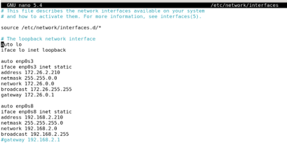
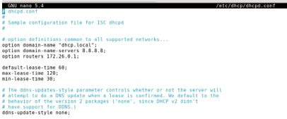
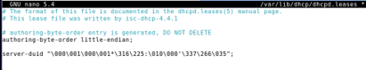
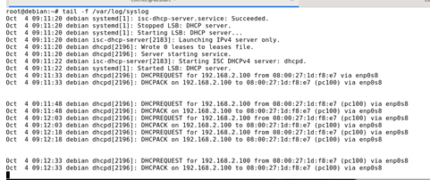
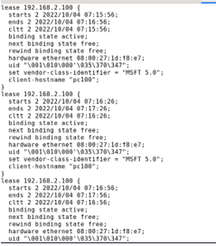

# CREAR SERVIDOR DHCP CON 2 TARJETAS

En esta forma vamos a crear el servidor DHCP, lo vamos a configurar con dos tarjetas; 
- 1º tarjeta: Adaptador puente; para poder salir a internet.
- 2º tarjeta: Red interna; para conectar el cliente en una red propia del servidor.

----------------------------------------------------------------------------------------
Con la misma configuración del paso anterior añadimos otra tarjeta.

Reiniciamos el sistema ` systemctl restart networking.service `

Modificamos el fichero de configuración  *dhcpd.conf* para cambiar los tiempos.

Ahora en la misma terminal abrimos dos pestañas.

En una ponemos ` tail -f /var/log/syslog ` y en la otra abrimos el fichero **/var/lib/dhcpd.lease**, borramos todo lo que haya dentro y lo dejamos abierto.

Resultado dentro del fichero *dhcpd.lease*: 

Esto lo hemos hecho para ver el recorrido que hace el [DHCP](https://github.com/SeleneBP/DHCP/blob/main/README.md), como explicamos anteriormente.

-----------------------------------------------------------------------------------------
#### LICENCIA

 Este obra está bajo una <a rel="license" href="http://creativecommons.org/licenses/by-sa/4.0/">licencia de Creative Commons Reconocimiento-CompartirIgual 4.0 Internacional</a>.
