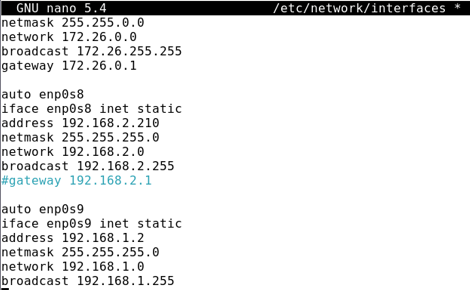
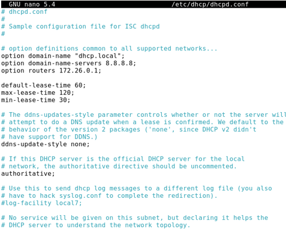
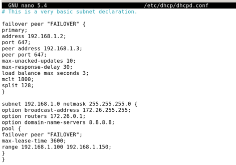
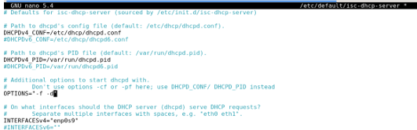
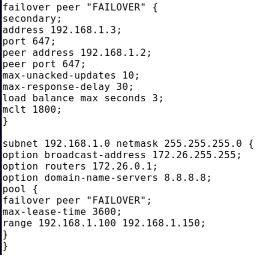
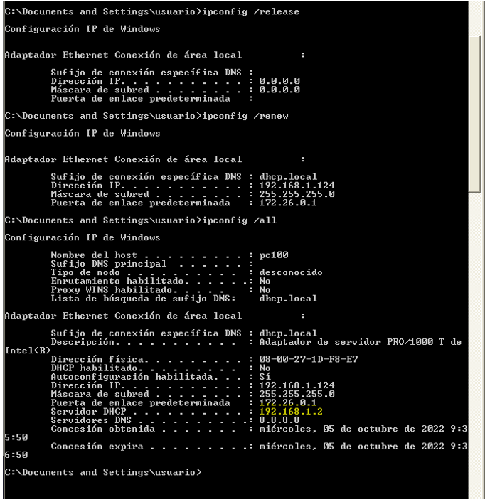
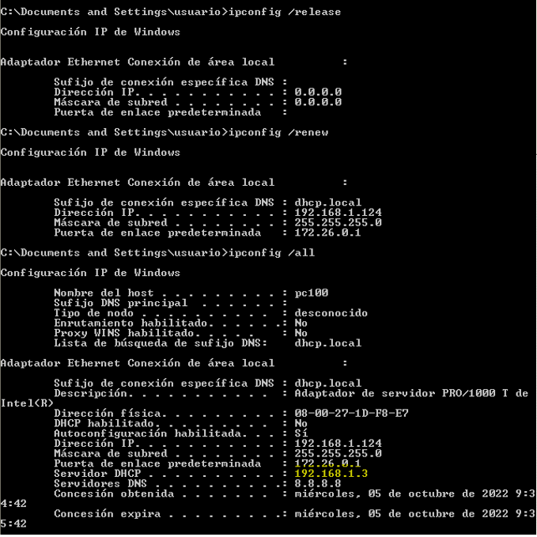

# FAILOVERS

En esta forma vamos a crear el servidor DHCP, lo vamos a configurar con tres tarjetas;

1º tarjeta: Adaptador puente; para poder salir a internet.
2º tarjeta: Red interna; para conectar el cliente en una red propia del servidor.
3º tarjeta: Adaptador puente.

-----------------------------------------------------------------------------------------

En el servidor ponemos una nueva tarjeta de red como adaptador puente y comentamos las demás. [NOTA 3](https://github.com/SeleneBP/DHCP/blob/main/NOTAS/NOTAS.md)

Reiniciamos el servicio -> ` systemctl restart networking `

Nos metemos en el fichero **/etc/dhcp/dhcpd.conf** y añadimos las siguientes líneas:

Y luego nos vamos a **/etc/dhcp/dhcpd.conf** y configuramos el *failover*.

También configuramos **/etc/defaul/isc-dhcp-server**. Aquí simplemente ponemos en las opciones *-f -d*, para forzar a poner la tarjeta de red.

Reiniciamos -> ` systemctl restart isc-dhcp-server `

Clonamos la máquina SERVIDOR 1 y a la máquina clon le cambiamos el nombre SERVIDOR 2.

En el SERVIDOR 2, solo cambiamos la IP, porque al ser clonada vendrá la IP del SERVIDOR. 

>Ip nueva: 192.168.1.3

También tenemos que cambiar la IP en el *failover*.

Para hacer la comprobación en el SERVIDOR 2, apagamos el servicio *iscp* y en el cliente ponemos -> ` ipconfig /release `, para que nos renueve la IP y miramos nuestra IP y que servidor nos lo ha proporcionado.

Vemos que la IP que nos ha dado ha sido el SERVIDOR 1. 

Volvemos hacer lo mismo pero al contrario.

En el SERVIDOR 1, apagamos el servicio *iscp* y en el cliente volvemos a poner -> ` ipconfig /release `.

-----------------------------------------------------------------------------------------
#### LICENCIA

 Este obra está bajo una <a rel="license" href="http://creativecommons.org/licenses/by-sa/4.0/">licencia de Creative Commons Reconocimiento-CompartirIgual 4.0 Internacional</a>.
