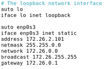
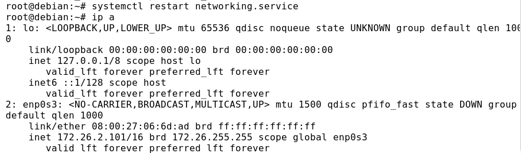
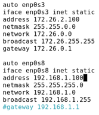
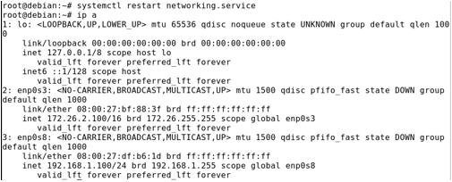
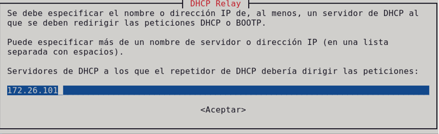
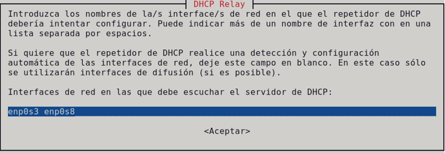
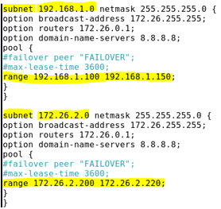
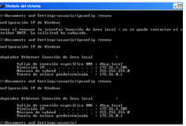

# RELAY

El servidor Relay sirve para enviar una sola petición al servidor principal, es decir, en el agente Relay le entra las peticiones a las que llegaría al servidor, sin embargo, es el agente Relay el que envía una petición propia al servidor, para que atienda a un solo segmento de red.
La desventaja es que hay que poner un equipo en cada red para que funcione el agente Relay.

----------------------------------------------------------------------------------------
Vamos a tener 3 máquinas virtuales. 
La primera máquina será el servidor DHCP, tendrá una tarjeta de red, será red interna.
La segunda será el agente Relay, con 2 tarjetas de red, una será adaptador puente y la otra red interna para conectarse con el cliente.
Y por último el cliente, solo tendrá una tarjeta de red, que será red interna.

----------------------------------------------------------------------------------------

Empecemos configurando el servidor DHCP.

Simplemente le ponemos una IP y reiniciamos el servicio.

Ahora configuraremos el agente Relay.

Le configuramos las 2 tarjetas de red.

Una vez que lo configuremos y tengamos internet, instalaremos un el paquete Relay -> ` apt install isc-dhcp-relay `
Directamente que se instale pondrá una pantalla azul para elegir las opciones, podemos hacerlo ahora o luego, en mi caso lo haremos ahora.

Aquí pondremos la IP del servidor DHCP.

Aquí pondremos las tarjeta de red de la máquina Relay.

Antes de hacer la comprobación, nos metemos en el fichero de configuración de ambos servidores. -> **/etc/dhcp/dhcpd.conf** [NOTA 4](https://github.com/SeleneBP/DHCP/blob/main/NOTAS/NOTAS.md)

En este fichero solamente tenemos que añadir todas las subnet necesarias. Como hemos dicho, esto se hace en el fichero de configuración de ambos servidores.

Ahora para hacer la comprobación, abrimos el cliente y pedimos un ip -> ` ifconfig /renew `, mientras que en el servidor DHCP, ponemos el siguiente comando -> ` tail -f /var/log/syslog `

Veremos como le llega las peticiones al servidor DHCP y le asigna una IP al cliente.

-----------------------------------------------------------------------------------------
#### LICENCIA

 Este obra está bajo una <a rel="license" href="http://creativecommons.org/licenses/by-sa/4.0/">licencia de Creative Commons Reconocimiento-CompartirIgual 4.0 Internacional</a>.
