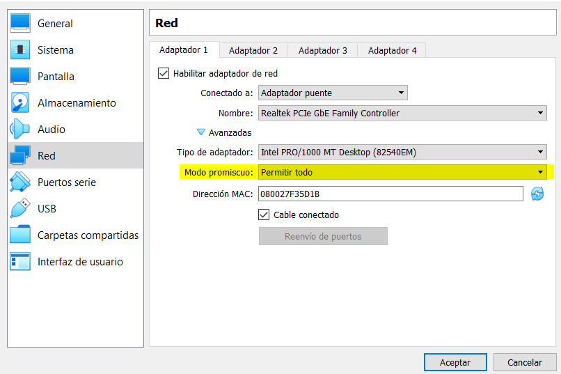
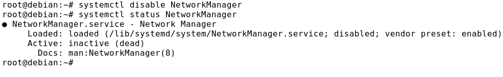
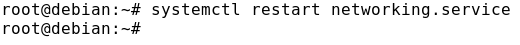
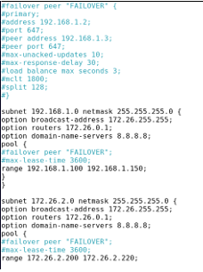

# NOTAS
>TODAS LAS MÁQUINAS UTILIZADAS USAN EN LA TARJETA DE RED EL MODO PROMICUO SELECCIONANDO 'PERMITIR TODO'

---------------------------------------------------------------------------------------------------------------

> NOTA 1

Hay que deshabilitar el NetworkManager

> NOTA 2

Reiniciamos el servicio networking

> NOTA 3

En este apartado no hace falta comentar las tarjeta de red, simplemente lo hacemos para que sea mucho más fácil y no nos liemmos.

> NOTA 4

Todo lo que ponga *failover* en este caso lo comentamos o lo borramos y donde ponga *authoritative* también. Esto se hace en el fichero de configuracion de ambos servidores. (**/etc/dhcp/dhcpd.conf**)

-----------------------------------------------------------------------------------------
#### LICENCIA

 Este obra está bajo una <a rel="license" href="http://creativecommons.org/licenses/by-sa/4.0/">licencia de Creative Commons Reconocimiento-CompartirIgual 4.0 Internacional</a>.
